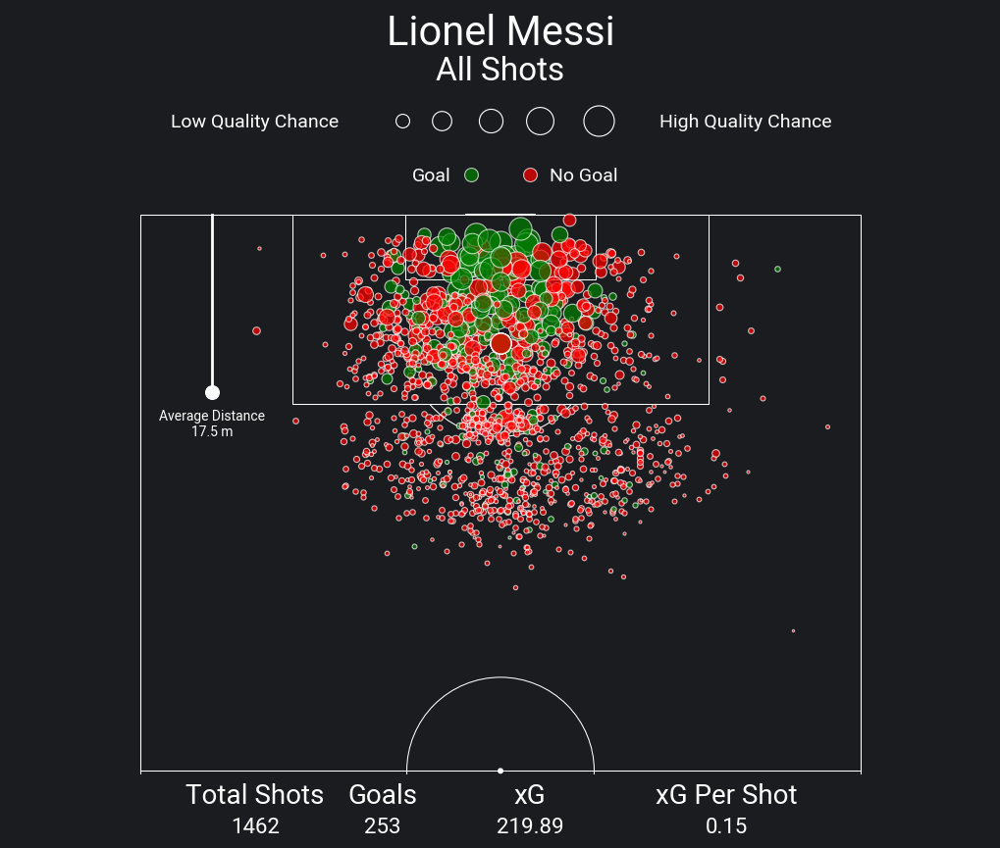

# Football Data Scraper & Visualizer

This project scrapes football data and visualizes it using the `mplsoccer` library. The notebook leverages `BeautifulSoup` for web scraping and uses `matplotlib` and `mplsoccer` to generate insightful football pitch visualizations.

## Features

- **Data Scraping:** Collect football-related data from websites using `requests` and `BeautifulSoup`.
- **Data Visualization:** Create visualizations of football data using `mplsoccer` and `matplotlib`, including heatmaps, player positions, and match events on a pitch.
- **Customization:** Customize the appearance of your football charts with fonts, colors, and more.

## Installation

1. **Clone the repository**:

   ```bash
   git clone https://github.com/your-username/FootballDataScraper.git
   cd FootballDataScraper
   ```

2. **Install the required packages**:
   Make sure you have Python 3 installed, then install the necessary libraries with pip:

   ```bash
   pip install -r requirements.txt
   ```

3. **Run the notebook**:
   Open the Jupyter notebook to execute the scraping and visualization:
   ```bash
   jupyter notebook FootballChart.ipynb
   ```

## Requirements

- Python 3.x
- `requests`
- `BeautifulSoup`
- `pandas`
- `matplotlib`
- `mplsoccer`

You can install all the dependencies with:

```bash
pip install -r requirements.txt
```

## Usage

1. **Data Scraping**: Customize the scraping code to target the football data you are interested in. The notebook includes an example of how to scrape match data.
2. **Visualization**: Use the `mplsoccer` library to visualize the data, including plotting player positions, shot maps, and more on a football pitch.

## Example Output

Here’s an example of a football pitch visualization generated by this project:



## Acknowledgements

- [mplsoccer](https://mplsoccer.readthedocs.io/en/latest/) for the football pitch visualizations.
- `BeautifulSoup` and `requests` for web scraping functionality.
